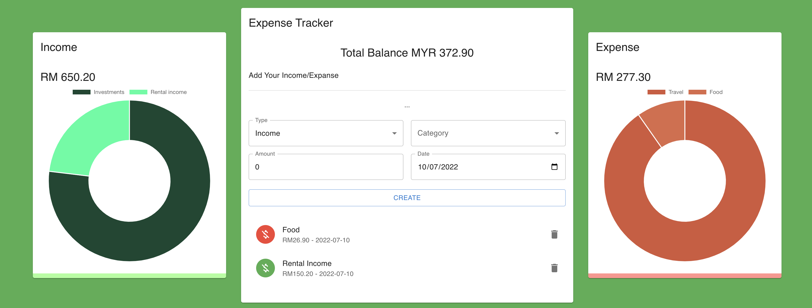
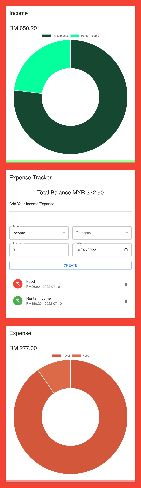

# React JS Simple Expense Tracker

## Description

Simple Expense Tracker Demo Application to demonstrate ReactJS + ChartJS + React MUIv5 Emotion.  
Enhanced with React Context Provider, Typescript and Styled Engine

## Installation

### `npm install`  
### `npm start`  
Builds the app for production to the `build` folder:  
### `npm run build`
